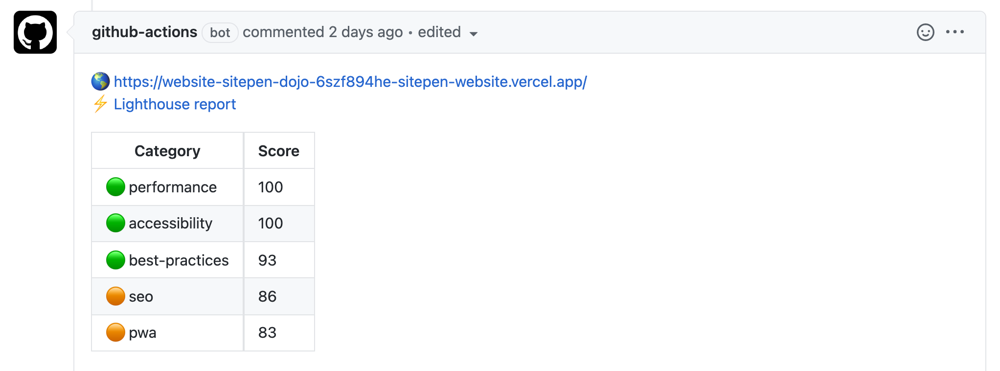
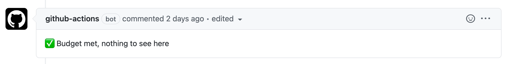
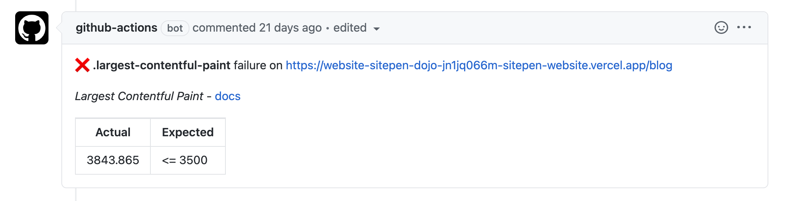

# vercel-lighthouse-action

## 🚦⚡️⏱ Automated Vercel Deployment and Lighthouse Audit with budget assertions using Github Actions.

This Repo builds on https://github.com/OskarAhl/Lighthouse-github-action-comment.

The complete action can be found in [vercel-lighthouse-action/workflows/pr-deploy-and-audit](https://github.com/tomdye/vercel-lighthouse-action/blob/main/workflows/pr-deploy-and-audit.yml).

An example budget can be found in [vercel-lighthouse-action/lighthouse/budget](https://github.com/tomdye/vercel-lighthouse-action/blob/main/lighthouse/budget.json).

### Action workflow
1. Deploy the PR using vercel-action
2. Run three lighthouse audits against the vercel preview url
3. Run budget assertions against the median run
4. Format the score and comment on PR
5. Format the assertions / budget result and comment on PR
6. Pass / Fail the PR based on the budget

### Integrations used:
* [amondnet/vercel-action](https://github.com/amondnet/vercel-action)
* [treosh/lighthouse-ci-action](https://github.com/treosh/lighthouse-ci-action)
* [sticky-pull-request-comment](https://github.com/marketplace/actions/sticky-pull-request-comment)

### Required Github Secrets:
For this to run, you will need to generate auth tokens and save them as secrets on your repository.
Please see the [vercel project linking documentation](https://github.com/amondnet/vercel-action#project-linking) for information on generating org_id and project_id.

- `VERCEL_TOKEN` - A vercel auth token
- `ORG_ID` - The linked vercel project org id
- `PROJECT_ID` - The links vercel project id
- `VERCEL_SCOPE` (optional) - The vercel team name if using vercel teams
